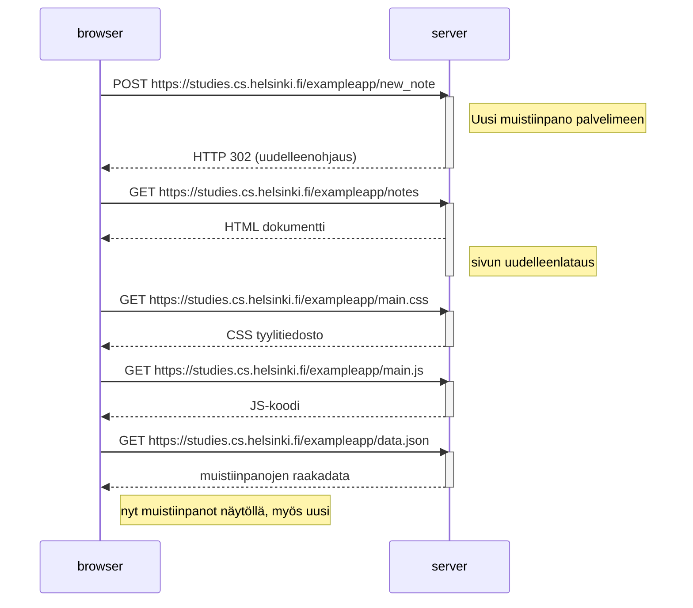

```mermaid
sequenceDiagram
    participant browser
    participant server


    browser->>server: POST https://studies.cs.helsinki.fi/exampleapp/new_note
    activate server
    Note right of server: Uusi muistiinpano palvelimeen
    server-->>browser: HTTP 302 (uudelleenohjaus)
    deactivate server

    browser->>server: GET https://studies.cs.helsinki.fi/exampleapp/notes
    activate server
    server-->>browser: HTML dokumentti
    Note right of server: sivun uudelleenlataus
    deactivate server

    browser->>server: GET https://studies.cs.helsinki.fi/exampleapp/main.css
    activate server
    server-->>browser: CSS tyylitiedosto
    deactivate server

    browser->>server: GET https://studies.cs.helsinki.fi/exampleapp/main.js
    activate server
    server-->>browser: JS-koodi
    deactivate server

    browser->>server: GET https://studies.cs.helsinki.fi/exampleapp/data.json
    activate server
    server-->>browser: muistiinpanojen raakadata
    deactivate server

    Note right of browser: nyt muistiinpanot näytöllä, myös uusi
```
